# 📱 Smart Agriculture System

A local AI model classifies a leaf photo as `Healthy`, `BacterialSpot`, or `LateBlight`, a Flutter app operates the farm, and Firebase Realtime Database shares state and data with an ESP32 that holds the core logic connecting the software to the hardware; that firmware is not in this repository.

---

## Contents

- [📋 What problem it solves](#problem)
- [🧪 Local AI](#local-ai)
- [🗄️ Firebase](#firebase)
- [🔌 Hardware](#hardware)
- [🔧 Key features](#key-features)
- [🖼️ App screens](#screens)
- [🧱 Architecture](#architecture)
- [🧰 Tech stack](#tech-stack)
- [📁 Project structure](#project-structure)
- [▶️ Getting started](#getting-started)
- [⚠️ Current limitations](#limitations)
- [✉️ Contact](#contact)

---

<a id="problem"></a>

## 📋 What problem it solves

Farm operators need one place to see environmental readings, react to crop-health issues, and control irrigation and fertilization without reprogramming hardware every time.

This app provides:

- A live dashboard for temperature, humidity, soil moisture, and NPK values
- Manual and automatic pump control (water, fertilizer 1, fertilizer 2)
- Tank capacity monitoring and operation logs
- Local disease detection from leaf photos (`Healthy`, `BacterialSpot`, `LateBlight`)
- In-app notifications (disease events, re-upload reminders, and hardware-written alerts)
- Remote Wi-Fi configuration for the controller (current and backup network)
- Email/password sign-in with an admin approval workflow

---

<a id="local-ai"></a>

## 🧪 Local AI

- Pick a leaf image from the gallery
- Run TensorFlow Lite inference in `plant_classifier_service.dart`
- Supported classes: `Healthy`, `BacterialSpot`, `LateBlight`
- Optional auto-analyze after upload
- Leaf status is written to Firebase so the controller can use it
- The Roboflow HTTP client in `disease_detection_service.dart` is commented out. The active path is TFLite. `disease_detection_cubit.dart` still logs "Calling Roboflow API", and the error text still tells the user to check a Roboflow API key

---

<a id="firebase"></a>

## 🗄️ Firebase

Email and password authentication, plus Realtime Database streams shared in `core/services/firebase_streams.dart`.

```text
/sensors              → temp, hum, moist, n, p, k
/leaf                 → status, needs_fix, last_updated, reupload_at
/config               → pumps, tanks, auto_water, auto_fert, refresh_time, wifi
/config/wifi          → old_ssid, old_pass, new_ssid, new_pass
/extra/logs           → manual/auto pump logs
/extra/notifications  → alert items + unread_count
/users                → app user records / approval state
```

Default schema sample: `lib/core/assets/data/firebase_struct.json`

---

<a id="hardware"></a>

## 🔌 Hardware

The ESP32 firmware listens to `/config` and publishes `/sensors`, `/leaf`, logs, and notification entries. This repository is the Flutter client that reads and writes those paths.

**In this repo:** RTDB read/write logic, Wi-Fi credential management, automation config editors, disease detection, and notification UI.

**Not in this repo:** microcontroller firmware source, PCB design, or sensor wiring.

---

<a id="key-features"></a>

## 🔧 Key features

### Farm monitoring
- Real-time sensor cards and pump status on the dashboard
- Tank capacity visualization for water and fertilizer tanks
- Pump activity logs with sensor snapshots at operation time

### Automation configuration
- Auto-water thresholds (soil moisture min/max)
- Auto-fertilizer thresholds for N, P, K
- Disease-linked fertilizer 2 dosing rules
- Pump mode switching (auto vs manual)
- Controller loop refresh time configuration

### Notifications
- Unread count and notification list synced from Firebase
- **App-generated:** disease alerts and scheduled re-upload reminders
- **Hardware-generated (displayed by app):** sensor and tank alerts written to RTDB by the controller firmware
- Mark-as-read and clear flows in the notifications UI

### Settings and hardware support
- Change current and backup Wi-Fi credentials at `config/wifi` (`old_ssid`, `old_pass`, `new_ssid`, `new_pass`)
- Recovery network documented in-app: `hardware_wifi` / `hardware_wifi_123`
- Developer toggles for which configuration sections appear in the UI

### Authentication
- Email/password sign-in and sign-up
- New non-admin users start as `pending` until an admin approves them
- Admin user management screen (approve / reject / block)
- Optional developer bypass to skip the login screen (`AppAccessControl.skipLogin`)

---

<a id="screens"></a>

## 🖼️ App screens

Screenshots are in `lib/core/assets/screens/`. A long screen is split into parts and reads left to right.

<table>
  <tr>
    <td align="center" width="320">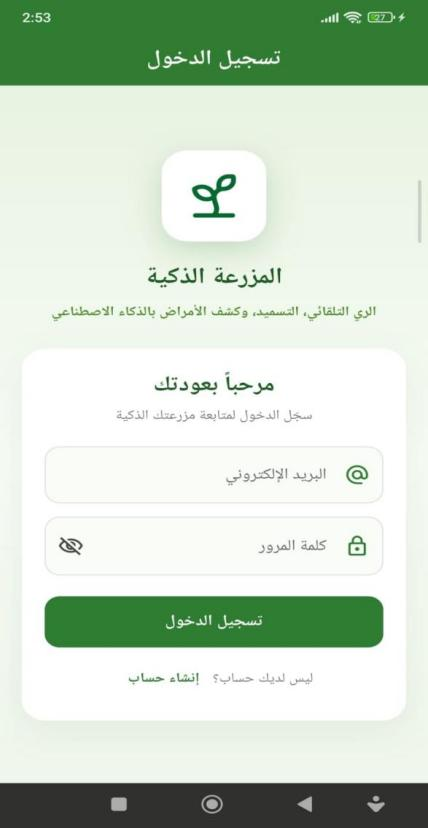<br>Sign in</td>
    <td align="center" width="320">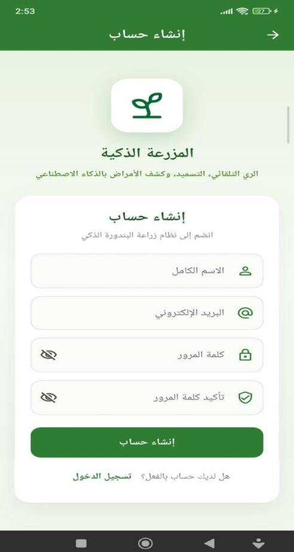<br>Sign up</td>
  </tr>
</table>

<table>
  <tr>
    <td align="center" width="320">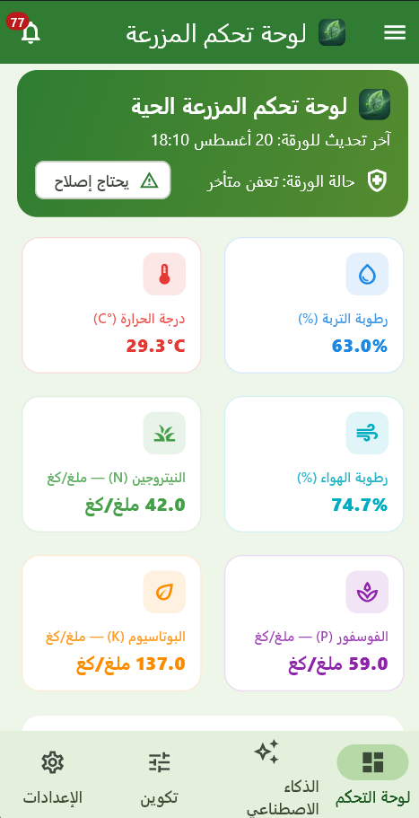<br>Dashboard 1</td>
    <td align="center" width="320">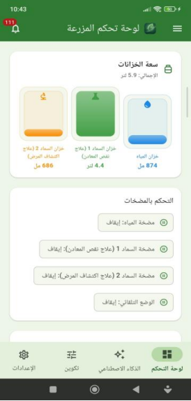<br>Dashboard 2</td>
    <td align="center" width="320">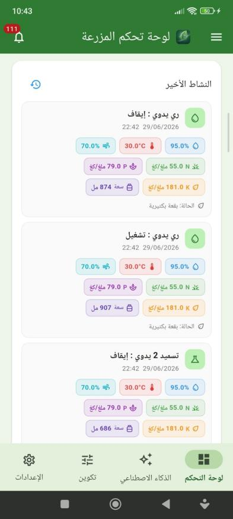<br>Dashboard 3</td>
  </tr>
</table>

<table>
  <tr>
    <td align="center" width="320">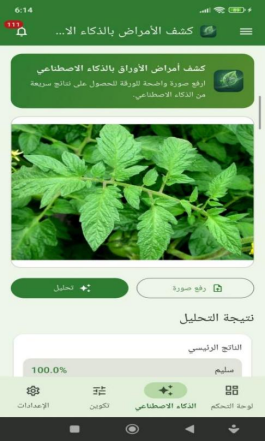<br>AI 1</td>
    <td align="center" width="320">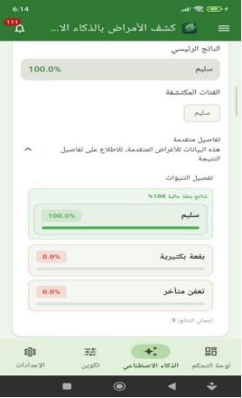<br>AI 2</td>
  </tr>
</table>

<table>
  <tr>
    <td align="center" width="320">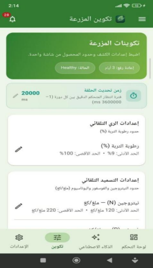<br>Config 1</td>
    <td align="center" width="320">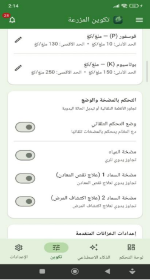<br>Config 2</td>
    <td align="center" width="320">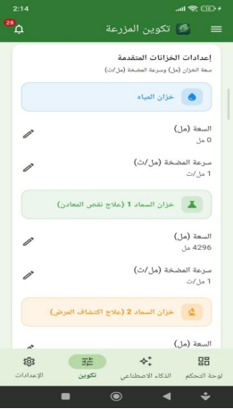<br>Config 3</td>
  </tr>
</table>

<table>
  <tr>
    <td align="center" width="320">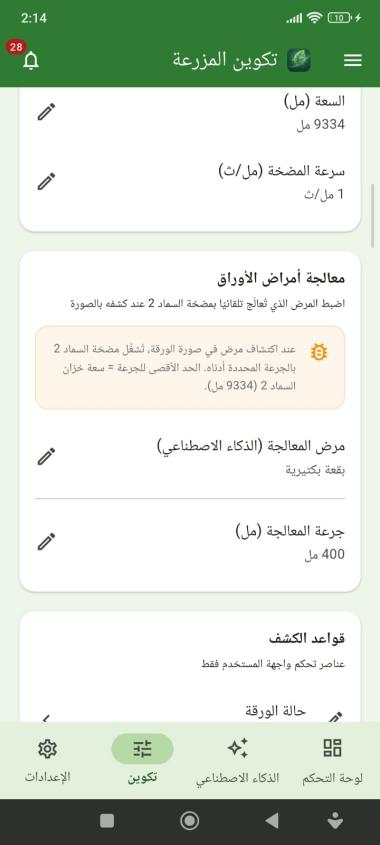<br>Config 4</td>
    <td align="center" width="320">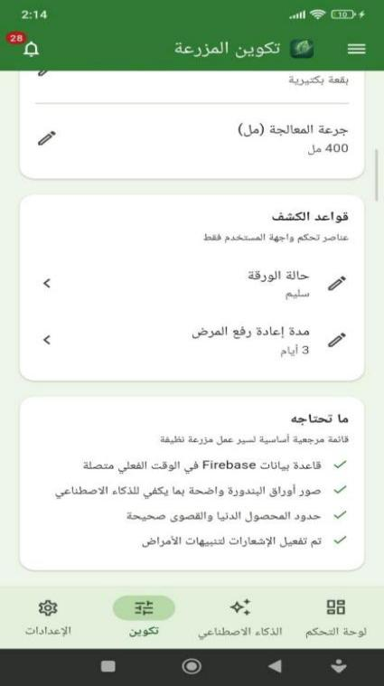<br>Config 5</td>
  </tr>
</table>

<table>
  <tr>
    <td align="center" width="320">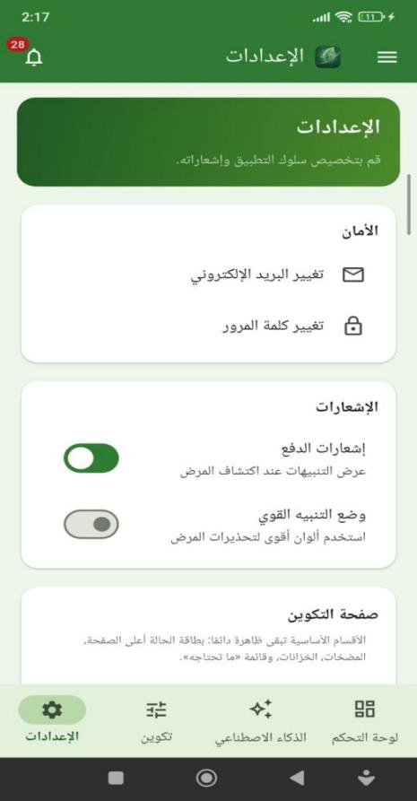<br>Setting 1</td>
    <td align="center" width="320">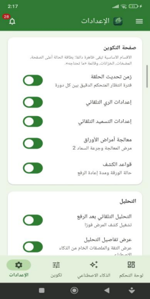<br>Setting 2</td>
    <td align="center" width="320">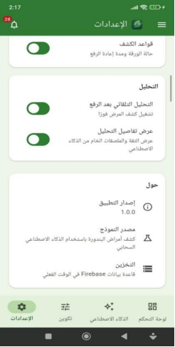<br>Setting 3</td>
  </tr>
</table>

<table>
  <tr>
    <td align="center" width="320">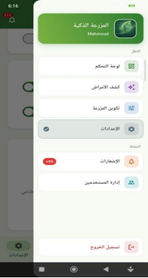<br>Drawer</td>
    <td align="center" width="320">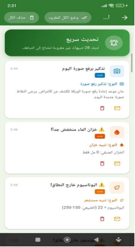<br>Notifications</td>
    <td align="center" width="320">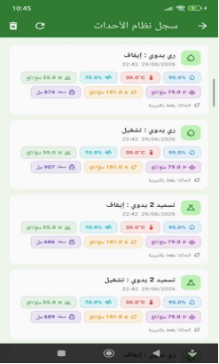<br>Logs</td>
  </tr>
</table>

<table>
  <tr>
    <td align="center" width="320"><br>Management</td>
  </tr>
</table>

---

<a id="architecture"></a>

## 🧱 Architecture

```text
Presentation (UI)
    ↓
Cubit (state via flutter_bloc)
    ↓
Services (Firebase, AI, notifications)
    ↓
Firebase Realtime Database  ↔  ESP32 controller
```

### Design choices
- **Shared Firebase streams** in `core/services/firebase_streams.dart` to avoid duplicate listeners and stale UI
- **Canonical farm schema** in `FarmPayload` with default seed data and legacy field migration
- **Separation of concerns:** UI widgets generally do not talk to Firebase directly
- **Startup resilience:** Firebase initialization failures are logged without crashing the app shell

---

<a id="tech-stack"></a>

## 🧰 Tech stack

| Layer | Technology |
|-------|------------|
| Framework | Flutter (Dart `^3.11.4`) |
| State management | `flutter_bloc` (Cubit), `equatable` |
| Auth | Firebase Authentication (email/password) |
| Realtime data | Firebase Realtime Database |
| Local ML | TensorFlow Lite (`tflite_flutter`) |
| Image handling | `image_picker`, `image` |
| Local preferences | `shared_preferences` |
| Hardware integration | ESP32 plus sensors and actuators via Firebase RTDB |
| Platforms in repo | Android, iOS, Windows, Web, Linux, macOS project files |

**Note:** `google_sign_in`, `cloud_functions`, and `dio` are listed in `pubspec.yaml` but are not part of the active runtime path today (Google Sign-In and Cloud Functions are unused; `dio` is only referenced in commented Roboflow code).

---

<a id="project-structure"></a>

## 📁 Project structure

```text
lib/
├── core/
│   ├── assets/          # icons, screens, TFLite model, seed JSON
│   ├── config/          # runtime + access control
│   ├── constants/
│   ├── localization/    # Arabic strings
│   ├── services/        # Firebase streams, pump logger
│   ├── uploads/         # placeholder in repo; runtime saves picked images to device temp storage
│   ├── utils/
│   └── widgets/
├── features/
│   ├── app_shell/       # main navigation
│   ├── auth/
│   ├── configurations/
│   ├── dashboard/
│   ├── disease_detection/
│   ├── firebase_data/
│   ├── notifications/
│   └── settings/
└── main.dart
```

---

<a id="getting-started"></a>

## ▶️ Getting started

### Prerequisites
- Flutter SDK (compatible with Dart `^3.11.4`)
- A Firebase project with Realtime Database and Authentication enabled
- Platform Firebase config files for the target you want to run

### Setup

1. Clone the repository
   ```bash
   git clone https://github.com/mahmoudjawad-2025/smart_agriculture_system.git
   cd smart_agriculture_system
   ```

2. Install dependencies
   ```bash
   flutter pub get
   ```

3. Configure Firebase
   - Add your platform Firebase config (for example `google-services.json` on Android)
   - Ensure `lib/firebase_options.dart` matches your Firebase project
   - Review and tighten `database.rules.json` before any real deployment (the checked-in rules are fully open for development)

4. Run the app
   ```bash
   flutter run
   ```

### Assets included in repo
- App icons: `lib/core/assets/icons/app/`
- TFLite model: `lib/core/assets/models/best_float32.tflite`
- Seed RTDB JSON: `lib/core/assets/data/firebase_struct.json`

---

<a id="limitations"></a>

## ⚠️ Current limitations

- Disease model is limited to the three classes in the bundled TFLite file; accuracy depends on training data and image quality
- UI is Arabic-first; English localization is not implemented
- Some settings toggles are developer-facing rather than end-user simplified
- `database.rules.json` is open read/write — suitable for development, not production as-is
- Automated test coverage is minimal (`test/widget_test.dart` is a compile smoke check, not integration tests)
- `flutter analyze` reports minor infos and warnings (deprecated APIs, debug prints) in parts of the codebase
- Primary development and testing have been on Android; other platform folders exist but are not equally exercised
- Leaf images are saved to the device temp directory at runtime, not to `lib/core/uploads/` (that folder is a repo placeholder)
- This is a working IoT mobile client. It is not a finished commercial product

---

<a id="contact"></a>

## ✉️ Contact

- **Email:** [mahmoudjawad02025@gmail.com](mailto:mahmoudjawad02025@gmail.com)
- **GitHub:** [@mahmoudjawad-2025](https://github.com/mahmoudjawad-2025/)
- **LinkedIn:** [linkedin.com/in/mahmoud-abu-alsebaa](https://linkedin.com/in/mahmoud-abu-alsebaa)
